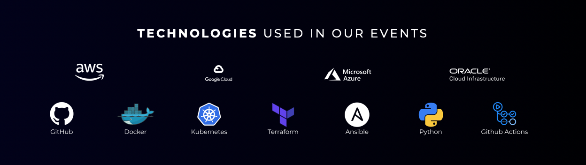

# AWS
AWS Cloud Development
[Link](https://www.youtube.com/redirect?event=video_description&redir_token=QUFFLUhqbVlaNVBZZy1KX2VUeWpnTUhsUDlTTVRFMHkzQXxBQ3Jtc0tsUUdUMXAtbE5SdktZaDZZRnJtNlIzSDdfMWpBdWxuVVJldm94WHRWYmlFQjYtUjdib1A0Zk9TSTkzTk1Ud0ZxRFBHNExwNTg5T01sdlVNSHlhdE9ZNzBucTJMSzVGX3hxRDB3MFhmcnUyeFRUU2tyRQ&q=https%3A%2F%2Fe.thecloudbootcamp.com%2FZTZdlh&v=UURJWE62_mo)

## Warm-up Week:
1. [] - Cloud Warm Up Night: Toolkit of the MultiCloud & DevOps Professional - [Link](./pre-mon.md)
2. t - Terraform w/ AWS
3. w - Docker
4. t - Kubernetes on Cloud
5. f - Terraform w/ google cloud

## AWS Bootcamp:
1. 
2. 
3. 
4. 
5. 
