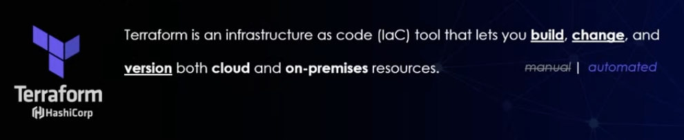
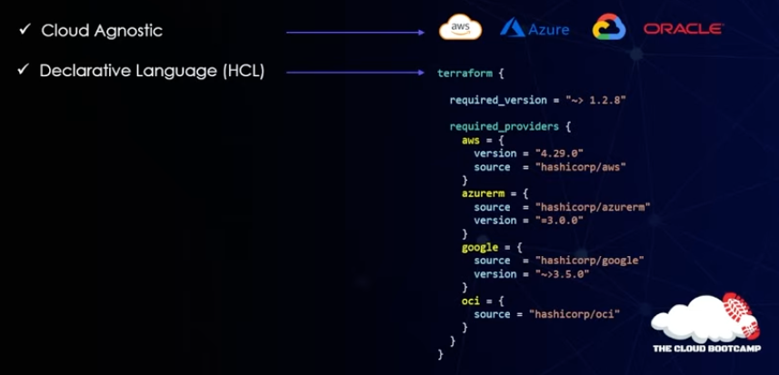
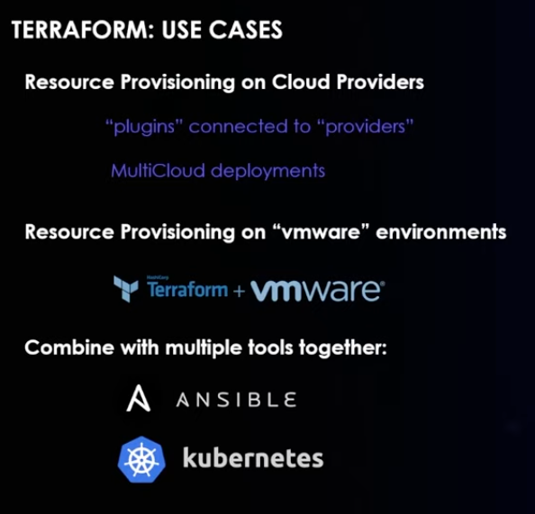
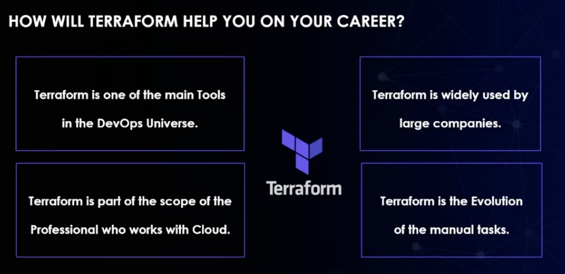
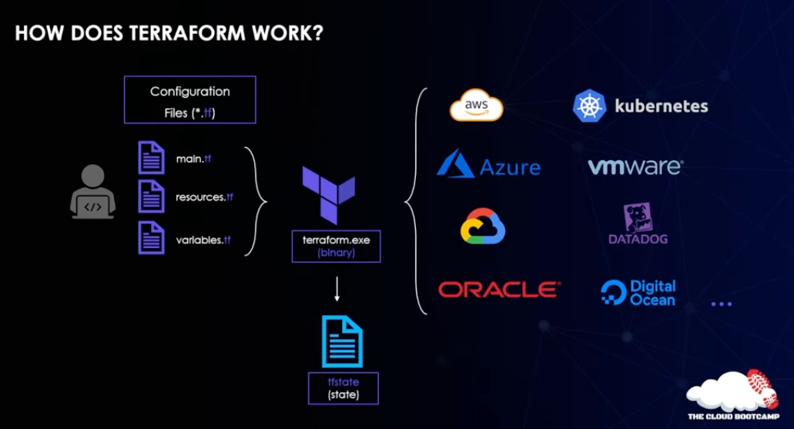
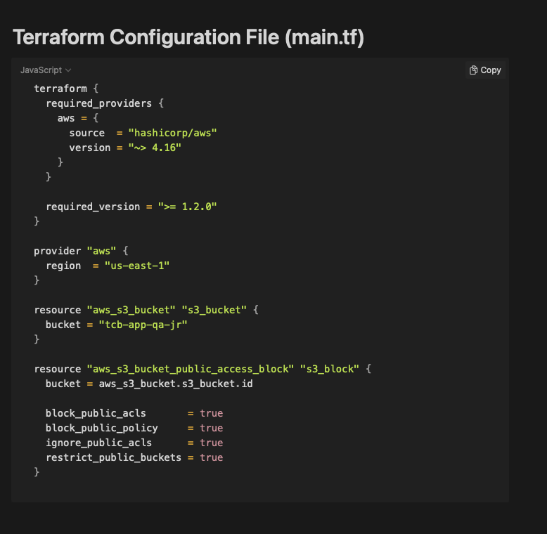
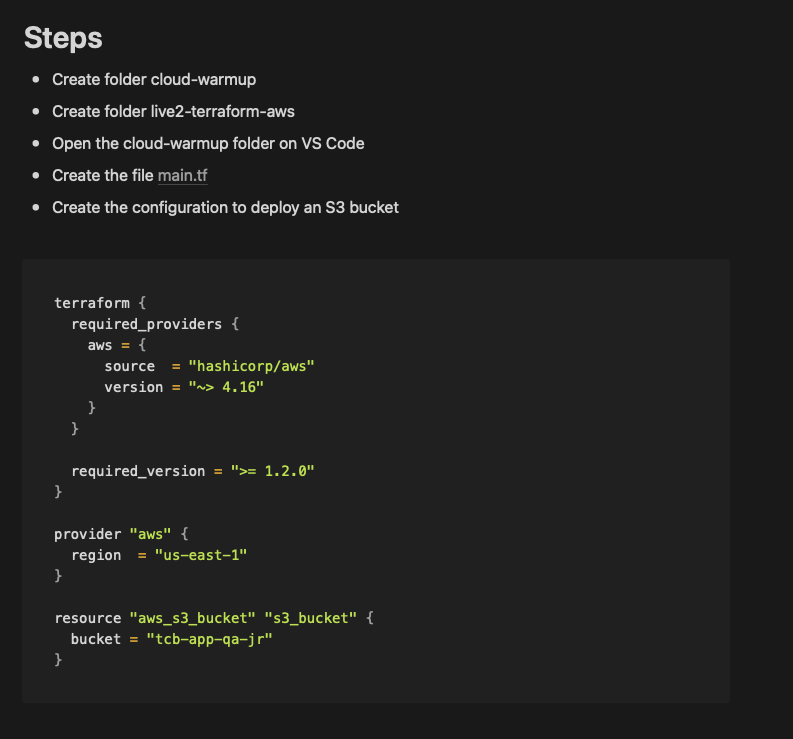
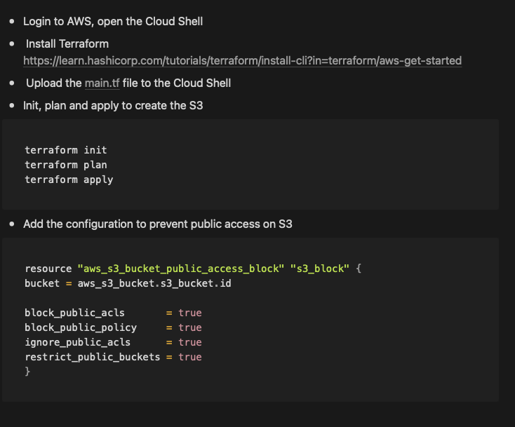

# Terraform with AWS:
- What is terraform


- What is it used for?

- What will learning it do for me?

- how does it work?
- it usees the .tf files as config files to provision the infrastructure in stated cloud prviders for you and records state of provisions


- Installing Terraform in Cloudshell
```s
sudo yum install -y yum-utils

sudo yum-config-manager --add-repo https://rpm.releases.hashicorp.com/AmazonLinux/hashicorp.repo

sudo yum -y install terraform
```

- upload main.tf to cloudshell
      
      
      
terraform destroy (destroys infrastructure if no files are contained)